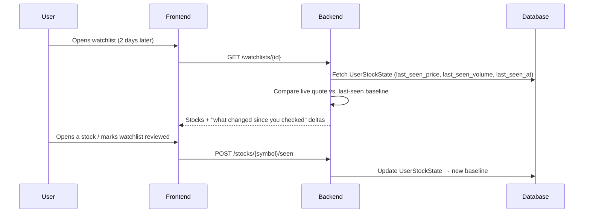
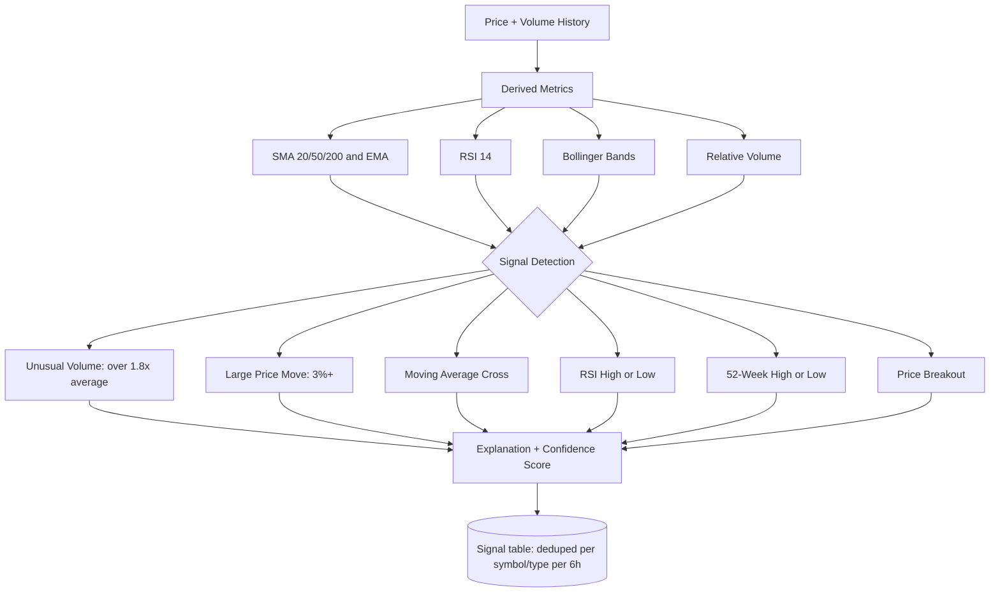
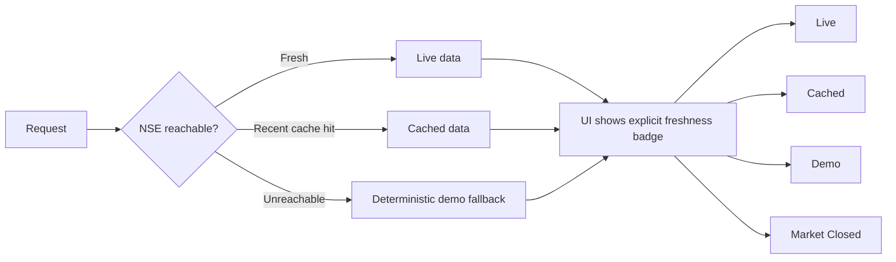
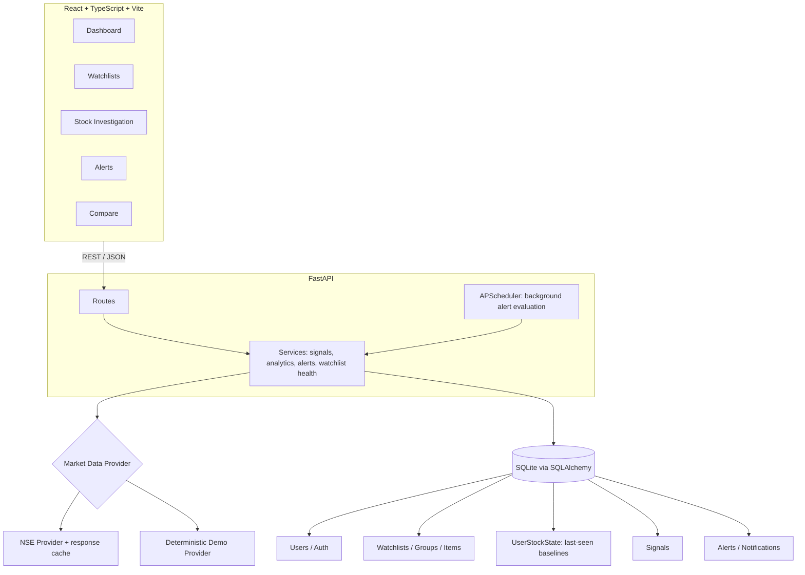

# 🐻 Watch Me Groww

Built for **CODE 2026 — Build a Smart Market Watchlist**.

---

## The problem with every watchlist

Open any watchlist app after a few days away and you get:

```
RELIANCE   ₹1,482.30   ▲ 1.42%
TCS        ₹3,910.10   ▼ 0.38%
INFY       ₹1,605.55   ▲ 0.91%
```

Numbers, no story. You still have to do the work: was that move normal or unusual? Is it the stock, the sector, or the whole market? Did anything actually change since Tuesday, or is this just noise?

**Watch Me Groww turns "here are some prices" into "here's what happened while you were away."**

---

## The core idea: state, not snapshots

Most watchlists are stateless — every visit looks identical. Watch Me Groww remembers.

Every stock in a watchlist has a persisted **`UserStockState`**: the price, volume, and timestamp of the moment you *last actually looked*. The next time you open the app, the backend diffs the current market against that baseline — not against some generic "today vs. yesterday" — so "what changed" is always relative to *you*.



Because the baseline lives in the database (not local storage), signing into the same account on a different device shows the *same* "since you last checked" state — the watchlist genuinely travels with the user, not the browser.

---

## "Why is it moving?" — an explainable signal engine

Instead of a black-box "buy/sell" score, every detected signal ships with the **evidence** behind it: the metric, the threshold it crossed, and a confidence value.



Every rule is deterministic and inspectable — no ML black box, no promised returns. A signal always reads like *"Volume is 2.1x its recent average while price is at a 52-week high,"* not *"Buy now."* Signals are deduplicated per symbol/type within a 6-hour window so the same event doesn't spam the user repeatedly.

---

## Reliability first: never a broken screen

Live market data (scraped from NSE's public endpoints) is inherently unreliable — rate limits, outages, and market-closed hours are the norm, not the exception. Watch Me Groww treats that as a first-class design constraint rather than an edge case.



The UI never silently pretends demo data is live — every screen is honest about where its numbers came from. The same pattern applies to news: real headlines are fetched and cached server-side when a provider key is configured, and the app is explicit when it's falling back rather than fabricating a story.

---

## Architecture



**Provider abstraction** keeps the app decoupled from any single data source — swapping NSE for another exchange feed later is a new provider class, not a rewrite. A background **APScheduler** job independently walks every user's alert rules on an interval, so alerts fire even if nobody has the app open.

---

## What you can actually do in it

| Area | What it does |
|---|---|
| **Watchlists** | Multiple watchlists, grouping, notes, pinning, quick search & add |
| **Dashboard** | NIFTY / BANK NIFTY / SENSEX, top movers, sector performance, watchlist health |
| **Stock view** | Chart (1D–5Y), SMA/EMA/RSI/Bollinger/MACD, fundamentals (P/E, EPS, ROE, D/E, margins), 52-week levels |
| **Since last check** | Per-stock and per-watchlist diff against your own last-seen baseline |
| **Signals** | Rule-based, explainable, evidence + confidence, deduped over a 6h window |
| **Alerts** | Price levels, % move, volume spikes, RSI, MA crossovers, breakouts — evaluated server-side on a schedule |
| **Compare** | 2–4 stocks side by side on performance, volatility, RSI, fundamentals |
| **Auth & persistence** | Header-based session auth; watchlists, notes, alerts and baselines all live in the DB, not the browser |

---

## Tech stack

| Layer | Technology |
|---|---|
| Frontend | React + TypeScript + Vite |
| Backend | Python + FastAPI |
| Database | SQLite + SQLAlchemy |
| Validation | Pydantic |
| Scheduling | APScheduler (background alert evaluation) |
| Market data | NSE public endpoints, cached, with deterministic demo fallback |
| News | GNews-backed, cached, clearly labeled freshness |
| Deployment | Vercel (static frontend + FastAPI serverless function) |

---

## Run it locally

**Backend**
```bash
cd backend
python -m venv .venv && source .venv/bin/activate   # or .venv\Scripts\Activate.ps1 on Windows
pip install -r requirements.txt
python -m app.seed
uvicorn app.main:app --reload --port 8000
```

**Frontend**
```bash
cd frontend
npm install
npm run dev
```
Open `http://localhost:5173`. Demo accounts: `demo@watchmegroww.app` / `demo1234`.

**Deploy:** push to GitHub → import into Vercel. `vercel.json` builds the Vite app from `frontend/` and routes `/api/*` to the FastAPI function in `api/index.py`. Set `DEMO_MODE`, `DATABASE_URL`, and (optionally) `GNEWS_API_KEY` as environment variables — SQLite on Vercel is ephemeral, fine for a demo, not for production.

---

## Why this fits the brief

The brief deliberately leaves "meaningful change," "how state persists," and "how it scales" open. Here's what we chose and why:

- **Meaningful change = personal, not generic.** Change is measured against *your* last-seen baseline (`UserStockState`), not a fixed "since yesterday" window — two users checking at different times see different, correctly-scoped deltas.
- **State persists server-side.** Watchlists, notes, alerts, and baselines live in SQLite via SQLAlchemy, so the same account on a new device sees identical state — no reliance on localStorage.
- **Staleness is surfaced, not hidden.** Every data point carries a freshness label (Live / Cached / Demo / Unavailable / Market Closed) instead of silently degrading.
- **Complexity is spent where it matters.** The signal engine and state-diffing logic are the deep part; auth, caching, and the provider layer are kept intentionally simple (header-session auth, in-memory cache, a two-provider abstraction) so they don't compete for attention with the actual idea.

---

## Safety & transparency

Watch Me Groww is a **decision-support tool, not a trading or execution platform.** It never promises returns, never presents a signal as guaranteed advice, and never labels demo data as live.

---

## The big idea

Most watchlists tell you what you own.

**Watch Me Groww tells you what changed while you weren't looking — and why it's worth your attention now.**
